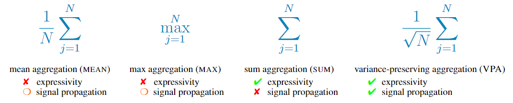

[](https://arxiv.org/abs/2403.04747)

# GNN-VPA: A Variance-Preserving Aggregation Strategy for Graph Neural Networks

This repository contains the code base for the paper available [here](https://arxiv.org/pdf/2403.04747.pdf). 

## Abstract

<p style="text-align: center;">Graph neural networks (GNNs), and especially message-passing neural networks, excel in various domains such as physics, drug discovery, and molecular modeling. The expressivity of GNNs with respect to their ability to discriminate non-isomorphic graphs critically depends on the functions employed for message aggregation and graph-level readout. By applying signal propagation theory, we propose a variance-preserving aggregation function (VPA) that maintains expressivity, but yields improved forward and backward dynamics. Experiments demonstrate that VPA leads to increased predictive performance for popular GNN architectures as well as improved learning dynamics. Our results could pave the way towards normalizer-free or self-normalizing GNNs.</p>



Figure 1: Comparison of commonly used message aggregation functions and variance-preserving aggregation.

## Setup

Install using `conda`:

```bash
conda env create -f environment.yaml
conda activate gnn-vpa
```

Install using `pip`:

```bash
pip install -r requirements.txt
```

## Data

The method was evaluated on the TUDataset collection, consisting of five social network datasets (IMDB-BINARY, IMDB-MULTI, COLLAB, REDDIT-BINARY and REDDIT-MULTI-5K) and four bioinformatics datasets (MUTAG, PROTEINS, PTC and NCI1) [1]. They are downloaded automatically upon the first call of the dataloader defined in [./src/datasets.py](./src/datasets.py).

## Usage

Train a single GNN:

```bash
python train.py model=gin agg=vpa dataset_name=IMDB-BINARY batch_run=false
```

To run the code for all 9 datasets and 10-fold cross-validation use the flag `batch_run`:

```bash
python train.py model=gin agg=vpa batch_run=true
```

To reproduce all results from the paper:

```bash
python train.py --multirun model=gin,gcn agg=vpa,sum,mean,max batch_run=true
python train.py --multirun model=sgc,gat agg=vpa,default batch_run=true
```

For a complete overview of available parameters see [./conf](./conf).

## Sources

Our code is based on the `pytorch-geometric` framework [2] and the implementation of the GIN architecture is inspired by [3].


[1] Morris, C., Kriege, N. M., Bause, F., Kersting, K., Mutzel, P., and Neumann, M. TUDataset: A collection of
benchmark datasets for learning with graphs. In ICML 2020 Workshop on Graph Representation Learning
and Beyond (GRL+ 2020), 2020.

[2] [https://pytorch-geometric.readthedocs.io/en/latest/](https://pytorch-geometric.readthedocs.io/en/latest/)  

[3] [https://github.com/weihua916/powerful-gnns/tree/master](https://github.com/weihua916/powerful-gnns/tree/master)


## Citation

If you find this work helpful, please cite
```bibtex
@article{schneckenreiter_gnn-vpa_2024,
   author = {Schneckenreiter, Lisa and Freinschlag, Richard and Sestak, Florian and Brandstetter, Johannes and Klambauer, G{\"u}nter and Mayr, Andreas},
   title = {{GNN-VPA}: A Variance-Preserving Aggregation Strategy for Graph Neural Networks},
   journal={arXiv preprint arXiv:2403.04747},
   year = {2024},
   institution = {ELLIS Unit and LIT AI Lab, Institute for Machine Learning, Johannes Kepler University, Linz},
   doi = {arXiv:2403.04747}
}
```
